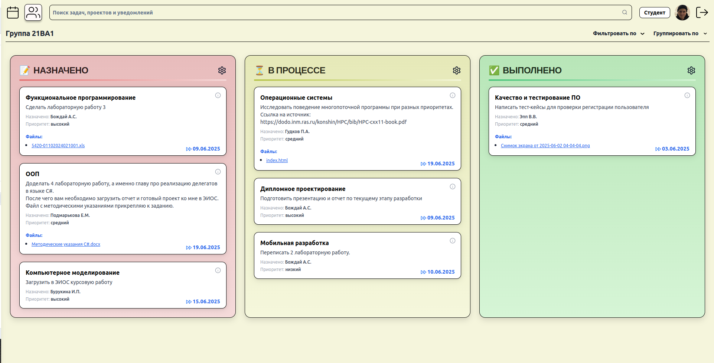

# Kanban Board

A simple **Kanban board** web application built for task management with team collaboration features. This project is in an **early stage**, so you may encounter some bugs or incomplete features

## Preview



## Features

* Create, edit, delete tasks
* Assign or change task assignees
* Mark tasks as completed
* Team collaboration on tasks
* User authentication
* Drag and drop tasks for easy organization

---

## Tech Stack

[](https://skillicons.dev)

---

## Installation and Running

### Backend

1. Clone the repository:

```bash
git clone https://github.com/MaxonPy/kanban.git
cd kanban
```

2. Create a virtual environment and install dependencies:

```bash
python -m venv venv
source venv/bin/activate   # On Windows: venv\Scripts\activate
pip install -r requirements.txt
```

3. Configure your PostgreSQL database and update the connection settings in the backend (check `backend/config.py` or `run.py` if applicable).

4. Run the backend server:

```bash
python run.py
```

The backend will be available at `http://localhost:8000`.

### Frontend

1. Navigate to the frontend folder:

```bash
cd public
```

2. Install dependencies:

```bash
npm install
```

3. Start the frontend:

```bash
npm run dev
```

The frontend will open in your browser at `http://localhost:5173`)


## Notes
* This is a **work-in-progress** version. Some features may not be fully implemented or may contain bugs.
* Make sure your PostgreSQL database is running and accessible before starting the backend.
